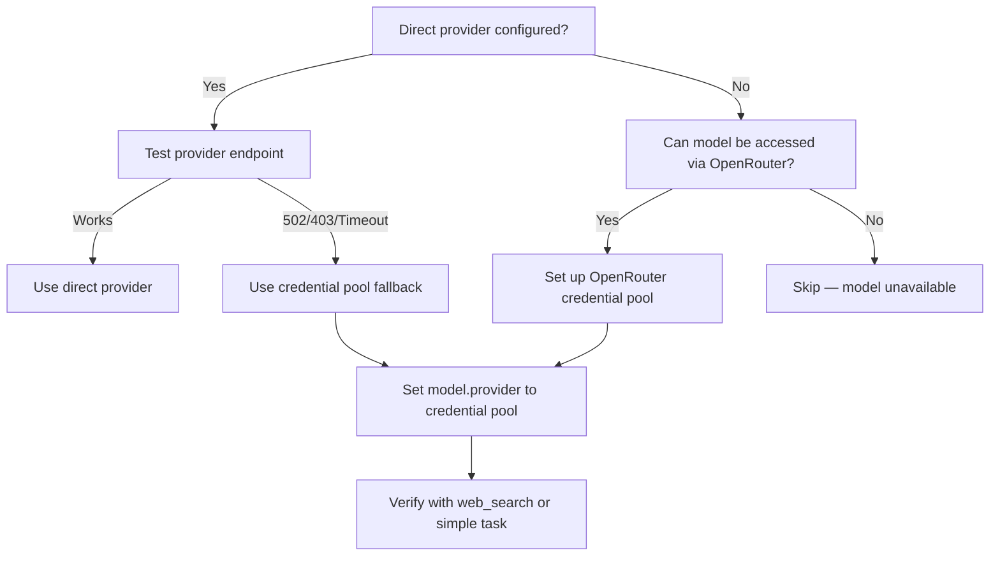

# Hermes Model Routing

Structured approach to routing tasks between models in Hermes Agent for optimal performance and cost efficiency.

## Quick Reference — Routing Table

| Task Tier | Examples | Model | Provider | Status |
|-----------|----------|-------|----------|--------|
| Dead Simple | One-shot Q&A, "hi", lookups, config checks, quick chat | mimo-v2.5-pro | xiaomi | ACTIVE — Haiku tier removed, folded into MiMo |
| Light (DEFAULT) | General chat, docs, config, provider health, kanban walkthroughs, simple agent tasks | mimo-v2.5-pro | xiaomi | ACTIVE |
| Medium | Code review, wiki work, planning, research, multi-step workflows, configuration | glm-5.1 | zai | ACTIVE — verify key not expired |
| Heavy | Complex coding, deep debugging, production changes, security, multi-agent heavy coordination | deepseek-v4-pro | deepseek | ACTIVE |
| Coding Subagent | Code gen via Kimi CLI, Claude Code w/Kimi | kimi-k2.6 | kimi (CLI only) | ACTIVE — Claude Code ANTHROPIC_BASE_URL pattern |

## Model Roles

### MiMo v2.5-pro (Default for everything up to Medium)
**Role:** Handles both Light AND Dead Simple tiers. Haiku tier removed (no backend configured).
**Role:** High-capability model for complex, important, or high-stakes implementation work.

**Use for:**
- Complex multi-file code changes
- Heavy reasoning and analysis
- Security-critical code
- Production configuration and infrastructure
- Tasks where correctness matters more than cost
- Deep debugging and root-cause analysis

### glm-5.1 / Z.AI (Medium Worker / Reliable Fallback)
**Role:** Primary medium-weight worker and reliable fallback

**Use for:**
- Code generation and editing
- File changes and debugging
- Repetitive tasks and bulk processing
- First drafts and initial passes
- Summaries and structured rewrites
- Lower-risk helper tasks
- Fallback when DeepSeek is exhausted

**GLM Coding Plan vs General API — different endpoints:**

| Plan | Endpoint | Auth | Notes |
|---|---|---|---|
| General (pay-per-token) | `https://api.z.ai/api/paas/v4` | `GLM_API_KEY` | Requires credits balance |
| Coding Plan (subscription) | `https://api.z.ai/api/coding/paas/v4` | `GLM_API_KEY` (coding plan key) | $18+/mo, restricted to supported coding tools |

The Coding Plan key returns "Insufficient balance" if you hit the general endpoint. The general key returns the same if you hit the coding endpoint. They're separate accounts.

**GLM-5.1 is a reasoning model** — it burns tokens on internal thinking before producing visible content. When calling via API, set `max_tokens >= 500` to leave room for both reasoning AND the actual response. With `max_tokens=50`, you'll get `content: ""` because all tokens were consumed by reasoning.

### Xiaomi MiMo (Budget Worker / Overflow)
**Role:** Ultra-cheap reasoning model for high-volume tasks
**Provider:** `xiaomi` (custom, OpenAI-compatible)
**Base URL:** `https://api.xiaomimimo.com/v1`

**Use for:**
- Bulk text processing at rock-bottom cost
- Reasoning tasks where GLM 5.1 is exhausted/rate-limited
- Quick lookups, translations, summaries
- Web search tasks (built-in web_search tool)
- Vision tasks (mimo-v2.5, mimo-v2-omni models only)

**Available models:**
| Model | Context | Vision | Price (in/out per 1M tok) |
|---|---|---|---|
| `mimo-v2.5-pro` | 1M | ✗ | $1 / $3 |
| `mimo-v2.5` | 1M | ✓ | $0.40 / $2 |
| `mimo-v2-pro` | 1M | ✗ | $1 / $3 |
| `mimo-v2-omni` | 256K | ✓ | $0.40 / $2 |
| `mimo-v2-flash` | 256K | ✗ | $0.10 / $0.30 | Not usable on active Token Plan endpoint as of 2026-04-28: HTTP 400 unsupported model |

**When to pick MiMo over GLM 5.1:**
- GLM 5.1 is rate-limited (429) → MiMo as fallback
- Task needs web search tool → MiMo has native web_search
- Ultra-high volume / cost-sensitive → use `mimo-v2.5` or `mimo-v2.5-pro` on Token Plan endpoints; do NOT route to `mimo-v2-flash` unless live health checks prove it is supported on the active endpoint
- Vision input needed and OpenAI unavailable → mimo-v2.5 or mimo-v2-omni

**Caveats:**
- Auth: `Authorization: Bearer` or `api-key` header (both work)
- All models return `reasoning_content` in responses (thinking mode)
- Rate limits: 100 RPM, 10M TPM per account
- Cache writes are currently free (limited time)
- System prompt should include: "You are MiMo, an AI assistant developed by Xiaomi. Today's date: ..."
- Xiaomi Token Plan subscriptions use regional endpoints rather than `api.xiaomimimo.com`. For Hermes' native `xiaomi` provider, use the OpenAI-compatible regional URL such as `https://token-plan-ams.xiaomimimo.com/v1`, `https://token-plan-cn.xiaomimimo.com/v1`, or `https://token-plan-sgp.xiaomimimo.com/v1`.
- The `/anthropic` regional endpoints (for example `https://token-plan-ams.xiaomimimo.com/anthropic`) are valid too, but they are for Anthropic-format clients. Do not point Hermes' native `xiaomi` provider at `/anthropic` unless you are intentionally using Anthropic protocol instead of the native Xiaomi/OpenAI-compatible path.

## Out-of-Band: Credential Pools (Fallback Routing Strategy)

Credential pools (`provider: credential_pool` in Hermes config, with a pool config like `openrouter: round_robin`) provide a critical **fallback layer** when direct providers fail.

### Use Case

| Situation | Solution |
|---|---|
| Direct provider endpoint returning 502/403 (e.g., MiMo Europe Token Plan down) | Route through OpenRouter credential pool |
| Need access to models not available as a direct provider | OpenRouter auto-discovers from its aggregated catalog |
| Migrating between providers without config changes | Switch `model.provider` to credential pool name |
| Testing if a model works without full provider setup | Quick OpenRouter credential pool test |

### Setup Pattern

```bash
# 1. Add credential pool to ~/.hermes/config.yaml
# Under `credential_pools` section:
# openrouter: round_robin
#
# 2. Ensure OPENROUTER_API_KEY is in ~/.hermes/.env
# (This is the single credential the pool uses)
#
# 3. Set provider to use the credential pool
# hermes config set model.provider openrouter
#
# OR use provider directly as 'openrouter' and Hermes
# auto-resolves it to the credential pool if defined
```

### Models Verified via OpenRouter Credential Pool

| Model | Pool Provider | Notes |
|---|---|---|
| `deepseek-reasoner` | openrouter | DeepSeek's reasoning model — works without direct DeepSeek API key |
| `gpt-5.4` / `gpt-5.5` | openrouter | OpenAI models routed through OpenRouter — alternative to direct OpenAI provider |
| Any OpenRouter-supported model | openrouter | Auto-discovered — check with `hermes model list` |

### Decision Flow for Using Credential Pools



### Implementation Note

When switching to a credential pool, the entire provider chain changes — all model routing rules still apply, but the **resolver** is the credential pool rather than a direct API endpoint. The credential pool's `round_robin` strategy cycles through available API keys (if multiple are configured in the pool). With a single `OPENROUTER_API_KEY`, round_robin acts as a simple pass-through aggregator.

### Common Pitfall

- **Don't confuse credential pools with direct provider configuration.** If you set `model.provider: openrouter`, Hermes looks for an `openrouter` block in `credential_pools`, not a direct provider. The models catalog is filtered differently — not all models in the catalog are accessible through the credential pool.
- **Credential pools don't support all the same model features.** Vision, tool calls, and streaming may behave differently through the pool vs. the direct provider. Test these before relying on them in production workflows.
- **When falling back from a failing direct provider**, verify end-to-end with a quick generic task (web search or simple generation) before routing production work through the pool.

### GitHub Models (Free Tier — No API Key Needed)
**Role:** Free AI model access using GitHub authentication
**Endpoint:** `https://models.inference.ai.azure.com/chat/completions`
**Auth:** `gh auth token` (same as GitHub CLI)

**Use for:**
- Quick prototyping without paid API keys
- Free GPT-4o-mini access for lightweight tasks
- Backup when other OpenAI-compatible endpoints are down
- Testing prompts before routing to paid providers

**Setup:** No config needed — just `gh auth login` (see github-auth skill). Use `gh auth token` as Bearer token.

**Verified models:** `gpt-4o-mini` (confirmed working 2026-05-11)

**Full details:** `references/github-models-api.md` in github-auth skill

### Kimi (Coding Agent Only — NOT for general Hermes use)
**Role:** Available only through coding agent subagents (Claude Code, etc.)

**Use for:**
- Code generation via Claude Code subagent with KIMI_API_KEY env var
- Cannot be used as a direct Hermes provider

**IMPORTANT RESTRICTION:** Kimi's coding API (`api.kimi.com/coding/v1`) restricts `sk-kimi-` keys to coding agent clients only (Kimi CLI, Claude Code, Roo Code, Kilo Code). The restriction is account/key-level, not header-based. Spoofing User-Agent or x-client headers does NOT bypass it. Standard Moonshot endpoints (`api.moonshot.ai`, `api.moonshot.cn`) also reject `sk-kimi-` keys. To use Kimi, delegate through a coding agent subagent.

#### Kimi-through-Claude-Code Pattern (verified working)

Claude Code talks Anthropic protocol. Kimi's `/coding` endpoint accepts Anthropic-format requests. Route Claude Code through Kimi by setting env vars:

```bash
export ANTHROPIC_API_KEY="<kimi-key>"           # sk-kimi-... key
export ANTHROPIC_BASE_URL="https://api.kimi.com/coding"

# Smoke test
claude -p "Say hello" --max-turns 1 --output-format json

# Real usage
claude -p "Build X feature in ~/project/" --max-turns 20 --allowedTools "Read,Edit,Bash"
```

**Key facts:**
- Direct API calls to `api.kimi.com/coding/v1` return 403 "access_terminated_error"
- Claude Code with `ANTHROPIC_BASE_URL` pointed at Kimi works because Claude sends Anthropic-format requests, which Kimi's `/coding` endpoint accepts
- Claude Code's system prompt is ~84k tokens — expect $0.20-0.30 overhead on first turn, then it amortizes
- Model shows as `claude-sonnet-4-6` in output but Kimi handles it on the backend
- Smoke test script: `scripts/kimi-claude-smoke-test.sh`

## Routing Rules
## Routing Rules

### Orchestrator Self-Routing (CRITICAL)
The orchestrator (Hermes lead, the agent you are) MUST follow these routing rules for its OWN model, not just for delegation. The model the session starts with is the model you use — and you should start with the right one.

| Task weight | Examples | Model |
|---|---|---|
| Heavy | Complex coding, deep debugging, production changes, security work, multi-agent coordination with real work | DeepSeek v4-pro |
| Medium | Code review, wiki work, planning, research, writing, configuration changes, multi-step tool workflows | GLM 5.1 |
| Light | General chat, Q&A, docs lookup, kanban feature walkthroughs, simple lookups, one-shot queries, config checks, routing discussions, provider health | MiMo v2.5-pro (DEFAULT) |
| Dead Simple | "hi", quick lookups, one-word answers, "what time is it", trivial Q&A | MiMo v2.5-pro (Haiku tier removed) |

**Anti-pattern:** Starting a session with DeepSeek v4-pro to explain kanban features, discuss routing tables, or answer documentation questions. This is ~10x cost for no quality gain. If the user asks "why are you using DeepSeek for this?", you routed wrong.

**Practical rule:** Light sessions default to MiMo. When the user asks a question that doesn't involve code execution, heavy reasoning, or production risk, the session should use MiMo. Reserve DeepSeek v4-pro for actual heavy lifting. USE THE RIGHT MODEL FOR THE JOB.

### Send to MiMo v2.5-pro (Dead Simple + Light default) when:
- Task is truly trivial: one-shot Q&A, quick lookup, "say hi", config value check
- General chat, Q&A, documentation questions
- Config checks, provider health, routing discussions
- Simple planning before delegating
- Any session where the user hasn't specified heavy work
- No multi-turn reasoning required
- Short responses expected
- User explicitly asks for a quick/cheap answer

### Send to GLM 5.1 when:
- Medium-complexity work: code review, wiki writing, planning, research
- Multi-step tool workflows
- Need reliable reasoning at reasonable cost
- MiMo is down or rate-limited

### Send to DeepSeek v4-pro when:
- Task is complex, important, or high-stakes
- Heavy reasoning, deep debugging, or multi-file code changes needed
- Security-critical or production infrastructure work
- Correctness matters more than cost
- Task genuinely needs the extra capability — do NOT default here for routine work

### Send to GLM 5.1 when:
- Task is coding-heavy and Kimi unavailable
- Task is repetitive or mechanical
- Task is lower risk
- You need a first pass/draft
- You need bulk processing
- You want cost-effective helper work
- OpenAI/Codex returns 403 errors

### Route through OpenRouter credential pool when:
- Direct provider endpoint returns 502/403 (e.g. MiMo Token Plan down)
- Testing a model that lacks a direct Hermes provider config
- Migrating between providers without rewriting config

### Send to Kimi (via Kimi CLI / Claude Code subagent) when:
- Heavy coding implementation needed
- Kimi's coding capabilities are specifically required
- Willing to spawn a coding agent subagent

### Use GitHub Models (free) when:
- Quick prototyping without paid API keys
- Free GPT-4o-mini/GPT-4o access for lightweight tasks
- Backup when other OpenAI-compatible endpoints are down
- Testing prompts before routing to paid providers
- Free Llama 405B for experimental heavy work

## Task Classification Flow

1. **Receive task**
2. **Is it dead simple or light?** (chat, Q&A, docs, config, trivial) → MiMo v2.5-pro
3. **Is it medium?** (code review, wiki, planning, multi-step) → GLM 5.1
4. **Is it heavy?** (complex coding, deep debug, production, security) → DeepSeek v4-pro
5. **Is it coding-only?** (needs Kimi specifically) → Kimi CLI subagent
6. **Need free/backup?** → GitHub Models

### Delegation Patterns

#### Code Implementation Tasks
```
Hermes (MiMo/GLM): Plan → GLM 5.1: Implement → Hermes (DS v4-pro): Review
```

#### Research + Action Tasks  
```
Hermes (MiMo): Plan → GLM 5.1: Research + Implementation → Hermes: Final review
```

#### Bulk Processing Tasks
```
Hermes (MiMo): Define → GLM 5.1: Execute → Hermes: Summarize
```

#### MiMo Light Overflow
```
Hermes (MiMo): Default for light sessions → GLM 5.1: Fallback if MiMo down
```

#### Kimi-Specific Coding (via subagent)
```
Hermes (DS v4-pro): Plan → Kimi CLI: Implement → Hermes: Review
```

## Configuration Notes

This routing works best when:
- `delegation.max_concurrent_children: 6` in config.yaml (default is 3)
- Toolsets are enabled for all models as needed

## Performance Benefits

- **Cost optimization**: MiMo ($1/3M tok) for dead simple and light, GLM for medium, DeepSeek only when needed
- **Speed**: MiMo is fast, DeepSeek is thorough
- **Specialization**: Each model handles tasks it's best at
- **Throughput**: Can route tasks concurrently to appropriate workers

## When to Override

Sometimes bend the rules:
- If GLM 5.1 is busy, OpenAI 5.4 can do it directly
- If task is urgent, OpenAI 5.4 can do it directly
- Always consider task priority and model availability

## Routing Reality Audit

The routing table documents the IDEAL assignment. Periodically verify that each tier actually works:

```
# Quick audit — check configured providers
hermes status | grep -E "(Provider:|✓|✗)"

# Verify DeepSeek v4-pro
timeout 30 hermes -z "Reply with exactly OK" --provider deepseek -m deepseek-v4-pro 2>&1

# Verify MiMo
timeout 30 hermes -z "Reply with exactly OK" --provider xiaomi -m mimo-v2.5-pro 2>&1

# Verify GLM 5.1
timeout 30 hermes -z "Reply with exactly OK" --provider zai -m glm-5.1 2>&1

# List models known by each provider (tests /models endpoint reachability)
curl -s https://api.deepseek.com/v1/models -H "Authorization: Bearer $DEEPSEEK_KEY" | jq '.data[].id'
curl -s https://token-plan-ams.xiaomimimo.com/v1/models -H "Authorization: Bearer $XIAOMI_KEY" | jq '.data[].id'
curl -s https://api.z.ai/api/paas/v4/models -H "Authorization: Bearer $ZAI_KEY" | jq '.data[].id'  # may 401 if key expired
```

**If a tier fails during audit:**
1. Check if the failed model is the default — `hermes config show` shows the default model/provider
2. If the key is expired, the hermes status shows ✓ but API returns 401 — run `hermes doctor` for deeper diagnostics
3. If a provider is down, reroute that tier to the next available: dead simple → MiMo, medium → DeepSeek, etc.
4. Log findings in wiki log.md so future sessions know

Also consult `provider-api-health-check` skill (`~/hermes/skills/hermes/provider-api-health-check/SKILL.md`) for more comprehensive multi-phase testing.

## Pitfalls

- **Aspirational routing ≠ actual routing.** The routing table documents the IDEAL — what models SHOULD be used for each tier. But some tiers may have no configured backend. Before acting on the routing table, verify the provider actually exists in config.yaml AND has a valid API key. Run `hermes status` and check the model list to confirm.
- **Defaulting to the heavy model for light sessions**: The orchestrator inherits whatever model the session started with. If that's DeepSeek v4-pro and the task is light (chat, Q&A, config checks, provider health, routing discussion), you are burning ~10x cost for zero gain. On the FIRST turn, classify the task. If it's light and you're on DeepSeek, you MUST acknowledge it and suggest switching to MiMo. Do NOT silently burn tokens.
- **Staying silent about a routing mismatch**: If the session is clearly light work and you say nothing about being on the wrong model, you've already failed. Call it out on turn one.
- **Kimi API restriction**: `sk-kimi-` keys are locked to coding agent clients. Do not attempt to configure Kimi as a direct Hermes provider — it will fail with "access_terminated_error". Only use through Kimi CLI.
- **Kimi key prefix**: Keys starting with `sk-kimi-` only work via coding agents. They do NOT work with `api.moonshot.ai` or `api.moonshot.cn`.
- **GitHub Models rate limits**: Free tier has unknown daily limits. Don't rely on it for production or high-volume work.
- **MiMo flash model**: `mimo-v2-flash` may not be available on all regional endpoints. Test before relying on it.

## Example Workflows

### 1. Feature Development
```
OpenAI 5.4: "Build a user authentication system"
↓
GLM 5.1: Implement auth endpoints, database models, validation
↓  
OpenAI 5.4: Review security, test coverage, API design
```

### 2. Research + Implementation
```
OpenAI 5.4: "Research GRPO papers and implement the method"
↓
GLM 5.1: Find and summarize GRPO research papers
↓
GLM 5.1: Implement GRPO training loop
↓
OpenAI 5.4: Review implementation against research
```

### 3. Bulk Data Processing
```
OpenAI 5.4: "Clean and analyze this dataset"
↓
GLM 5.1: Perform data cleaning, normalization, basic stats
↓
OpenAI 5.4: Analyze results, create summary report
```

This routing system makes Hermes lean, task-driven, and execution-focused while maintaining quality control and cost efficiency.
